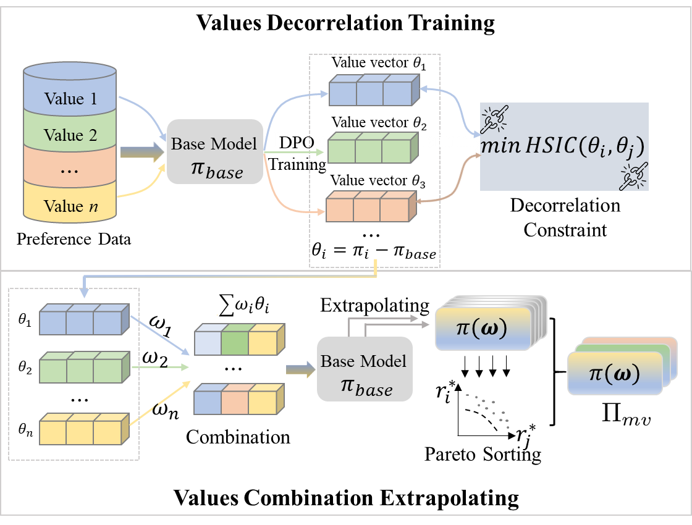

# Multi-Value Alignment for LLMs via Value Decorrelation and Extrapolation (MVA)

This project contains partial code and dataset files for **MVA (Multi-Value Alignment)**, 
a parameter-based method for multi-objective alignment. 
It achieves multi-value models by eliminating vector interference and performing composite extrapolation, as illustrated in the figure below:



The full version of the code is coming soon...

## Data
HH data is available at: [HH Data](https://huggingface.co/datasets/Anthropic/hh-rlhf)

Beavertails data is available at: [Beavertails Data](https://huggingface.co/datasets/PKU-Alignment/PKU-SafeRLHF-10K)

## Environment Requirements
Python 3.10.16
torch==2.1.2
torchaudio==2.1.2
torchvision==0.16.2
tqdm==4.67.1
transformers==4.45.0
triton==2.1.0
trl==0.9.6
safetensors==0.5.3
scikit-learn==1.7.0
scipy==1.15.3
seaborn==0.13.2

## How It Runs
After preparing the necessary files, follow these steps:

Step 1: Run dpo.py to obtain the helpful vector:
 ```bash
   python dpo.py
2. Step 2: Run mva.py to obtain the harmless vector, 
and configure the search space for extrapolation to generate multiple model configurations (i.e., vector weights):
   ```bash
   python mva
